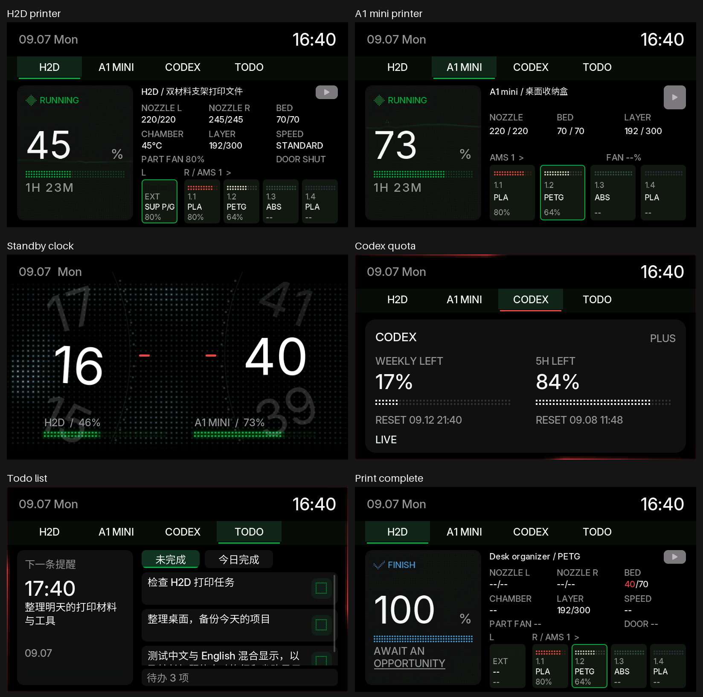

# ESP32-P4 桌面屏

800×480 横屏 LVGL 界面：拓竹 H2D / A1 mini 打印状态、待机时钟、Codex 配额页、待办列表。项目包含两套可选的局域网服务：Python 待办 / 飞书同步服务，以及向开发板提供 JPEG 画面的视频中转服务。

**本项目仅面向通过 Agent 进行开发和硬件适配的用户。** 请将仓库、开发板型号、接线信息和功能需求交给你的编程 Agent，由 Agent 阅读 [AGENTS.md](AGENTS.md)、评估兼容性，并完成本地开发与验证。

本仓库提供开发参考源码，不提供开箱即用固件或面向用户的手工编译、烧录教程。[English](README.md)。

## 使用 Agent 开发

1. 向 Agent 提供主控型号、屏幕和触摸规格、接线以及主机运行环境。
2. 说明需要的功能、界面调整和外部服务接入要求。
3. 要求 Agent 先阅读 `AGENTS.md` 和中英文 README，核对硬件差异，再完成适配与验证。

可直接交给 Agent 的需求示例：

> 请先阅读 AGENTS.md 并检索本项目，根据我提供的开发板规格、接线和功能需求完成适配。验证界面与主机服务，明确哪些功能已验证、哪些仍需真机确认。真实凭据仅保存在本地。

## 界面预览



使用项目实际 LVGL 渲染器导出的 800×480 界面示意图，打印机、配额和待办内容均为测试数据，并非实机照片。单张图片与导出步骤见[界面图集](assets/preview/README.md)。

## 支持的硬件

- **主控：** ESP32-P4，16 MB Flash，PSRAM（200 MHz）。时钟数字缓存在 PSRAM，建议 16 MB PSRAM。
- **Wi-Fi：** 板载 ESP32-C6，经 ESP-Hosted、SDIO slot 1。默认脚在 `sdkconfig.defaults`：CLK 18、CMD 19、D0 14、D1 15、D2 16、D3 17、C6 复位 54。
- **屏：** ST7701 MIPI-DSI，物理 480×800，RGB565，双 lane。LVGL 排版是 800×480，`p4_display.c` 用 PPA 旋转。BSP 选项 `CONFIG_BSP_LCD_TYPE_1024_600` **名字来自旧示例，这里实际是 480×800 ST7701 分支**，不要按名字改成 1024×600 屏。
- **触摸：** GT911，I2C SDA GPIO7、SCL GPIO8。背光 GPIO23，LCD 复位 GPIO5。
- **工具链：** ESP-IDF **5.4.x**（参考版本为 5.4.2；依赖清单允许 `>=5.4,<6.0`），**LVGL 8.3.11**。不要用 IDF 6 或 LVGL 9。

即使使用同型号开发板，也应由 Agent 核对硬件配置。使用其他硬件时，Agent 可复用 `components/portable_ui`、`todo_service` 和 `video_relay`，并适配板级显示、触摸和无线接口。

## 项目结构

| 路径 | 作用 |
| --- | --- |
| `components/portable_ui/` | 800×480 LVGL 界面（打印机页、时钟、Codex、待办、事件动画） |
| `todo_service/` | 局域网待办 HTTP + SQLite，可选飞书同步 |
| `video_relay/` | 局域网 JPEG 中转，避免 P4 软件解 H2D High Profile |
| `main/bambu_config.c` | NVS 打印机配置 + 本机网页 |
| `assets/` | 字体、图标、界面预览（`assets/preview/`） |

板级适配代码：`main/p4_display.c`、`main/main.c` 的 BSP 启动、`vendor/` 里的 BSP/LCD、C6 SDIO 脚、以及 `sdkconfig.defaults` 中的硬件配置。

## 本地配置边界

由 Agent 参考 `main/wifi_credentials.example.h`、`main/todo_credentials.example.h`、`main/codex_credentials.example.h` 和 `todo_service/deploy.env.example` 整理本地配置。真实参数保存在已忽略的本地文件中；待办设备令牌须与服务端 `TODO_DEVICE_TOKEN` 一致，中转地址定义在 `main/video_relay.h`。

三个本地凭据头文件和 `todo_service/deploy.env` 已由 `.gitignore` 排除。`main/video_relay.h` 是受版本控制的文件，公开提交时应保留占位地址。Wi-Fi 和服务凭据会编入本地固件，因此不要发布填入真实配置后构建的二进制文件。

打印机的局域网 IP、序列号、访问码**不编进固件**。联网后屏幕会显示开发板 IP 和 6 位 PIN。浏览器打开 `http://<开发板IP>/`，用户名 `admin`，密码为该 PIN，再保存 H2D / A1 mini。PIN 每次重启都会变。打印机 MQTT 为局域网 8883，用户名 `bblp`。本快照不发送暂停 / 取消 / 开始打印指令。

## 主机服务

**待办**（`todo_service/`）：Python 标准库 + SQLite，支持可选的飞书同步。由 Agent 根据主机环境完成配置，技术参考见[待办服务说明](todo_service/README.md)。服务从进程环境变量读取配置，不会自动加载 `deploy.env`。

**视频中转**（`video_relay/`）：把 H2D 的 RTSPS（以及可选的 A1 JPEG）转成 800×480 JPEG。参考配置中，H2D 视频使用中转，A1 mini 支持直连 JPEG。MQTT 与直播能否同时稳定运行取决于打印机固件和局域网模式，需要在实际设备上验证。详见[视频中转说明](video_relay/README.md)和[协议文档](video_relay/P4_DEV.md)。

## H2D 视频：中转与直连

H2D 视频提供中转方案，并保留直连解码实现：

- **中转（当前固件默认路径）**：主机接收打印机 RTSPS/H.264 视频，解码并转为 800×480 JPEG，再发送给 ESP32-P4 显示。需运行 `video_relay/`，并设置 `main/video_relay.h` 中的主机地址。
- **直连（需修改固件接入）**：`main/bambu_video_rtsp.inc` 和 `components/openh264/` 保留了 ESP32-P4 直接接收 RTSPS/H.264 并解码的实现，仅处理 IDR 关键帧，不连续解码 P/B 帧；刷新速度取决于关键帧间隔和板端解码性能。

当前 `main/bambu_video.c` 的 H2D 分支固定调用 `play_relay()`，网页和屏幕没有直连/中转切换项，也不会在中转不可用时自动直连。使用直连需要 Agent 接入保留的实现并完成固件验证；不能仅修改中转地址完成切换。两条路径处理的是实时视频流，不是 MP4 文件播放。A1 mini 的直连使用 JPEG 图片流。

## Agent 验证参考

```sh
python video_relay/tests.py
python todo_service/test_feishu.py
python tools/check_open_package.py
python tools/secret_scan.py
```

`video_relay/tests.py` 需要 Pillow（部分路径还要 `imageio-ffmpeg` 提供的 ffmpeg）。`tools/clock_dial_check.py` 需要首次运行 `idf.py` 下载的 LVGL `lv_math.c`。`tools/verify_bambu_config.py` 需要 `IDF_PATH` 和主机 C 编译器。

## 许可证

第一方代码为 MIT（`LICENSE`）。第三方说明见 `NOTICE`。Cisco OpenH264 条款在 `components/openh264/upstream/LICENSE` 和 `firmware/OpenH264-LICENSE.txt`。
