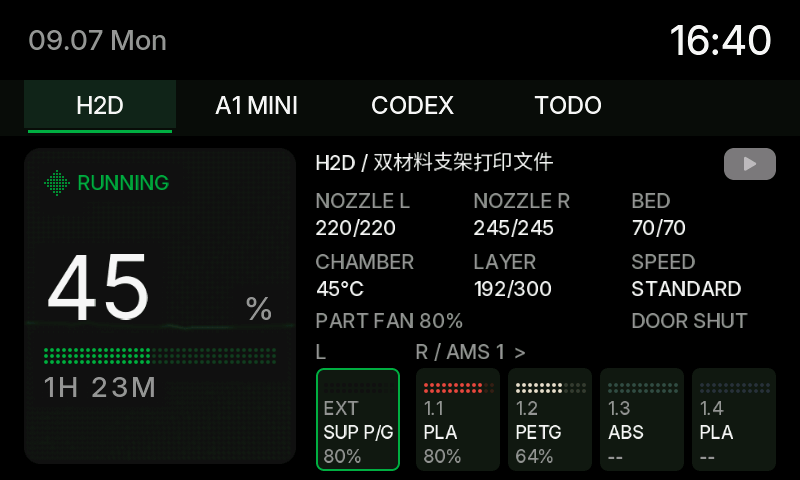
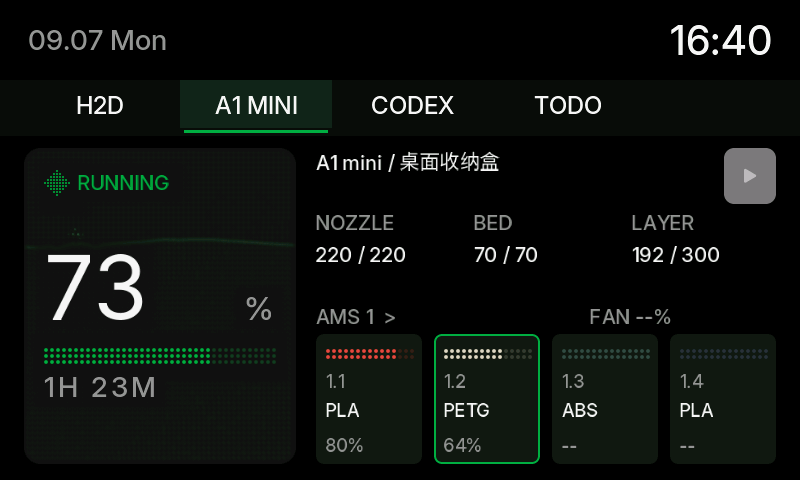
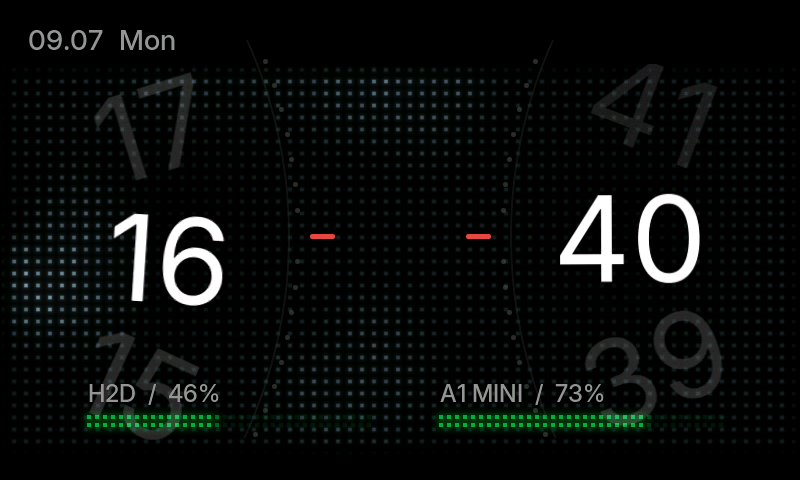
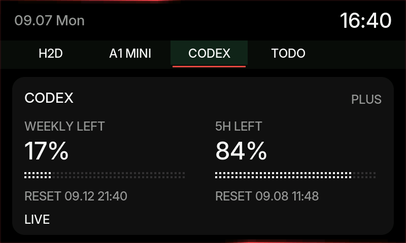
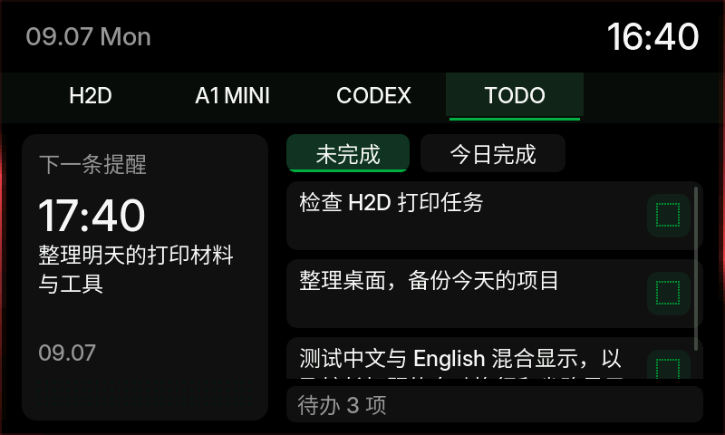
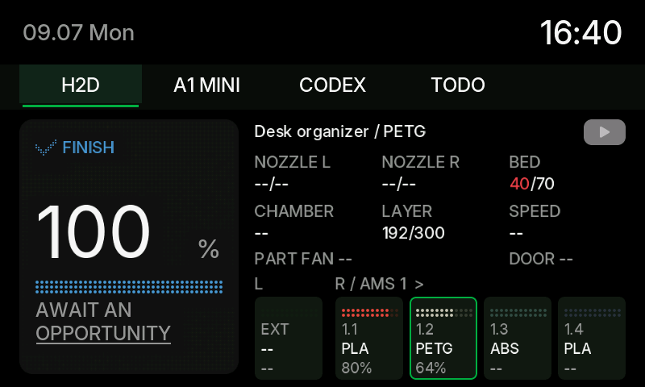

# Interface gallery / 界面图集

These 800×480 PNGs are rendered from the actual LVGL UI using synthetic fixtures in `tools/host/smoke.c`. They are interface illustrations, not device photographs or live account data. The sample network address and PIN shown in the fixtures are demonstration values.

以下图片由项目实际 LVGL 界面和测试数据生成，尺寸为 800×480；不包含真实账户、打印机连接信息或实机拍摄画面。测试画面中的地址和 PIN 为演示值。

| Screen / 页面 | Preview / 示意图 |
| --- | --- |
| H2D printer / H2D 打印状态 |  |
| A1 mini printer / A1 mini 打印状态 |  |
| Standby clock / 待机时钟 |  |
| Codex quota / Codex 配额 |  |
| Todo list / 待办列表 |  |
| Print complete / 打印完成 |  |

## Reproduce on Windows

Requires Python with Pillow 10.1 or newer, CMake, Visual Studio 2022 C tools, ESP-IDF 5.4.x (`IDF_PATH`), and LVGL 8.3.11 sources fetched by `idf.py reconfigure`.

From the repository root:

```powershell
python -m pip install 'Pillow>=10.1'
.\tools\verify_ui_windows.ps1
python -B tools/export_previews.py assets/preview-review
```

For an existing LVGL 8.3.11 checkout, pass `-DLVGL_ROOT=/path/to/lvgl` when configuring `tools/host` with CMake. The default is `managed_components/lvgl__lvgl`. Run `smoke.exe` from an output directory, then pass that directory to the exporter. The exporter writes six individual PNGs and `overview.png`.

The remaining PNG/GIF/HTML files are supplemental state and animation previews; the six screens above are the main README gallery.
